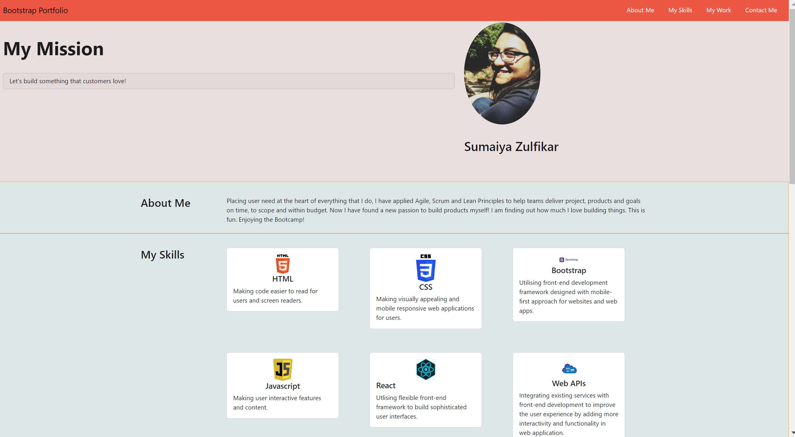

# Bootstrap-Portfolio

## Project Objective

To create a personal Developer's portfolio using Bootsrtap for prospective employers looking to hire Front End Developers.

## Description

This is my portfolio to showcase my skills as a Frontend Developer for organisations looking to build or improve their front-end website and applications. I have used my knowledge in HTML, CSS and Bootstrap to create this portfolio.

Feel free to connect or send me a message through the contact me section  of my [portfolio](https://sumzulfikar.github.io/Bootstrap-Portfolio/) and let us build products that customers love!

Learning:

- Bootstrap is packed with many styling features built-in which reduces need for comprehensive CSS styling.
- Seperating out each acceptance criteria using issues options in github enabled me to keep track of progress and test aginst those continuously.

## Table of Contents 

- [Installation](#installation)
- [Usage](#usage)
- [Credits](#credits)
- [License](#license)

## Installation

Click this link to see the profile: https://sumzulfikar.github.io/Bootstrap-Portfolio/

## Credits

Bootcamp materials and resources on HTML, CSS and Bootstrap.
Help from TAs and my class mates.

## License

MIT License

## Badges

## Features

Built by HTML, Bootstrap and CSS.

## How to Contribute

n/a

## Tests

Acceptance Criteria met
